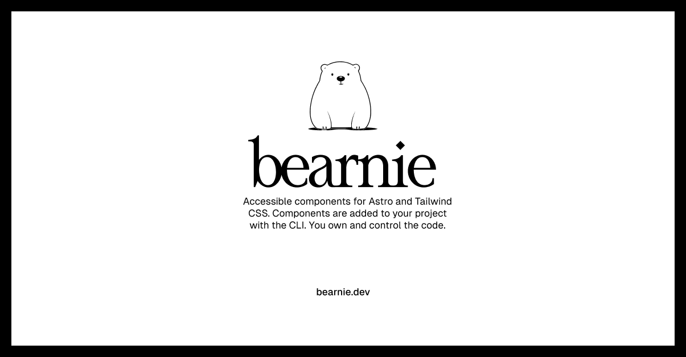

# Bearnie

A set of accessible components that you can customize, extend, and build on. Start here then make it your own. Open Source. Open Code. **Use this to build your own component library.**

## Documentation

Visit [https://bearnie.dev/docs](https://bearnie.dev/docs) to view the documentation.

## Contributing

Please read the [contributing guide](./CONTRIBUTING.md).

## Sponsors

If you find Bearnie useful, consider [sponsoring the project](https://github.com/sponsors/michael-andreuzza).

## License

Licensed under the [MIT license](./LICENSE).
